# Constrained card and scrolling page audit

Status: inventory and page-by-page design dispositions complete. The Account redesign is
implemented; the remaining page dispositions have not been implemented.

Last audited: 2026-08-09.

## Why these surfaces are grouped

This audit covers production pages and editor views that present their main content as a centered,
width-constrained card, table frame, card grid, or similar surface inside a larger available canvas.
The common symptoms are:

- the main surface uses substantially less horizontal space than its container;
- information-dense content feels compressed even when more workspace is available;
- the page header, search, filters, or primary controls share the content's scroll container and can
  disappear while the user scrolls; or
- the view uses the same constrained-card composition even when its header is already outside the
  scrolling region.

`/account`, `/privacy`, and the editor's World settings view are explicitly in scope. This means the
inventory includes centered single-card pages as well as list and catalog pages.

The audit found **25 production surfaces**: 19 routable pages and 6 editor views.

## Routable pages in scope

### Primary application pages

| Route      | Surface                                         | Width constraint | Scroll and header behavior                                                                                                                                                                                            | Source                                                  |
| ---------- | ----------------------------------------------- | ---------------- | --------------------------------------------------------------------------------------------------------------------------------------------------------------------------------------------------------------------- | ------------------------------------------------------- |
| `/`        | Home introduction card                          | `576px`          | The card is centered in the viewport. It normally does not scroll, but it uses the same narrow single-card composition.                                                                                               | `src/app/page.tsx`, `src/app/page.scss`                 |
| `/worlds`  | World library, including Worlds and Trash views | `820px`          | `.worldsPage` owns vertical scrolling. The library header and view controls are in that scroll flow and are not sticky.                                                                                               | `src/app/worlds/page.tsx`, `src/app/worlds/page.scss`   |
| `/account` | Account and security card                       | `560px`          | `.accountPage` owns vertical scrolling. The title and account controls are inside the card and scroll away with long registered-account content.                                                                      | `src/app/account/page.tsx`, `src/app/account/page.scss` |
| `/privacy` | Privacy notice card                             | `560px`          | Reuses the account page and card classes. The whole card participates in the page scroll.                                                                                                                             | `src/app/privacy/page.tsx`, `src/app/account/page.scss` |
| `/starter` | Starter-world JSON card                         | `1024px`         | The page is constrained, but the large JSON block has its own `70vh` internal scroll. The page header usually remains visible while the JSON scrolls. It still has the same constrained header-plus-card composition. | `src/app/starter/page.tsx`, `src/app/starter/page.scss` |
| `/play`    | Published-world catalog                         | `1040px`         | `.playCatalogPage` owns vertical scrolling. The title and search are in the same scroll flow as the card grid and are not sticky.                                                                                     | `src/app/play/page.tsx`, `src/app/play/play.scss`       |

### Account entry pages

All five routes render the same `AuthShell`. The card is capped at `460px`, and `.authPage` owns
vertical scrolling. These pages are less information-dense than catalogs, so the eventual layout may
remain narrower, but they match the expanded structural definition and should be considered rather
than silently omitted.

| Route              | Surface                   |
| ------------------ | ------------------------- |
| `/sign-in`         | Sign-in form              |
| `/register`        | Account registration form |
| `/forgot-password` | Account recovery request  |
| `/reset-password`  | Password reset form       |
| `/verify-email`    | Email verification result |

Source: `src/components/auth/AccountAuthForm.tsx` and
`src/components/auth/AccountAuthForm.scss`.

### Administration pages

The administration shell puts all page content inside `.adminContent`, which owns vertical scrolling.
Every oversight page uses `.adminPage`, capped at `1180px`. `.adminPageHeader` is static, so page
headers scroll away with long tables and detail sections. Table frames and `.adminSection` panels are
the content cards.

| Route                      | Surface                    | Content after the header                                                                              |
| -------------------------- | -------------------------- | ----------------------------------------------------------------------------------------------------- |
| `/admin/users`             | User oversight list        | One bordered table frame                                                                              |
| `/admin/users/[id]`        | User detail                | Multiple metadata, controls, worlds, sessions, and permissions cards                                  |
| `/admin/worlds`            | World oversight list       | One bordered table frame                                                                              |
| `/admin/worlds/[id]`       | World detail               | Metadata, controls, and world-document cards                                                          |
| `/admin/publications`      | Publication oversight list | One bordered table frame                                                                              |
| `/admin/publications/[id]` | Publication detail         | Constrained detail content; it uses `adminDetailSection` rather than the standard `adminSection` card |
| `/admin/audit`             | Audit history              | Filters card followed by an events/table card                                                         |

Source: `src/app/admin/admin.scss` and the pages under
`src/app/admin/(oversight)/`.

The administrator sign-in route is also in scope as a constrained single-card page:

| Route            | Surface                                        | Width constraint | Scroll behavior                                                                        |
| ---------------- | ---------------------------------------------- | ---------------- | -------------------------------------------------------------------------------------- |
| `/admin/sign-in` | Administrator password and second-factor forms | `440px`          | `.adminSignIn` owns vertical scrolling; all headings and controls are inside the card. |

Source: `src/app/admin/sign-in/page.tsx` and `src/app/admin/admin.scss`.

## Editor views in scope

The canonical editor route is `/worlds/[editorSlug]`. The legacy `/editor` route family renders the
same editor and is not a separate surface for this inventory.

| Editor view    | Surface                                                   | Width constraint | Scroll and header behavior                                                                                                                       | Source                                                                                                  |
| -------------- | --------------------------------------------------------- | ---------------- | ------------------------------------------------------------------------------------------------------------------------------------------------ | ------------------------------------------------------------------------------------------------------- |
| Items          | Header, search, and bordered item table                   | `980px`          | `.itemCatalog` owns the scroll. The page title, Add item button, and search all scroll away with the item rows.                                  | `src/components/studio/ItemCatalog.tsx`, `src/app/editor/page.scss`                                     |
| NPCs / Story   | Placeholder content card                                  | `576px`          | `.placeholderWorkspace` owns any overflow. The 48px editor toolbar is outside that scroller and is already pinned structurally.                  | `src/app/editor/page.tsx`, `src/app/editor/page.scss`                                                   |
| Debug / Issues | Placeholder content card                                  | `576px`          | Same shared placeholder composition as NPCs / Story.                                                                                             | `src/app/editor/page.tsx`, `src/app/editor/page.scss`                                                   |
| World settings | Reset and publishing content inside a single card         | `576px`          | The card is narrow relative to the workspace and `.placeholderWorkspace` owns its overflow. The editor toolbar is already outside that scroller. | `src/app/editor/page.tsx`, `src/app/editor/page.scss`, `src/components/publication/PublishingPanel.tsx` |
| Settings       | Placeholder content card                                  | `576px`          | Same shared placeholder composition.                                                                                                             | `src/app/editor/page.tsx`, `src/app/editor/page.scss`                                                   |
| Logic overview | Heading followed by a two-column grid of navigation cards | `680px`          | The overview is centered and does not currently own a scroll region, but it leaves substantial workspace unused.                                 | `src/components/logic/shared/LogicWorkspace.tsx`, `src/components/logic/shared/LogicWorkspace.scss`     |

World settings was measured in the running app at a `1920px` viewport: the editor workspace was
`1180px` wide while the card remained `576px` wide. NPCs / Story, Debug / Issues, and Settings use
the exact same `PlaceholderWorkspace` and `placeholderWorkspaceCard` implementation.

## Observed examples of the problem

These measurements are from the running development app and are included to make the audit
reproducible:

- **Items:** at a `1920px` viewport, the available editor workspace was `1180px` wide while the
  header, search, and table remained `980px` wide. The item scroller was `571px` tall with `1630px`
  of content. Scrolling it by `700px` moved the header from `y=124` to `y=-576` and the search from
  `y=233.5` to `y=-466.5`.
- **World library:** at a `1920px` viewport, the page was `1920px` wide while the library remained
  `820px` wide. In a short viewport, scrolling the library page moved the header with the content,
  confirming that it is not pinned.
- **World settings:** at a `1920px` viewport, the workspace was `1180px` wide while the card remained
  `576px` wide. Its toolbar stayed outside the scrolling content, so only the width problem is shared.
- **Published worlds:** the header, search, result status, and card grid are all capped at `1040px`
  inside the full-width `.playCatalogPage` scroller.

## Similar surfaces that are not in scope

These were inspected so they do not need to be rediscovered during implementation.

| Surface                                         | Why it does not count                                                                                                                                 |
| ----------------------------------------------- | ----------------------------------------------------------------------------------------------------------------------------------------------------- |
| Hosted player at `/play/[slug]`                 | It is a full-height terminal with a fixed-height header outside the terminal scroll. It does not use a centered content card.                         |
| Editor Map view                                 | The map deliberately fills the available workspace and owns its controls.                                                                             |
| Logic Events editor                             | It uses a full-height rail-and-tree layout. Its branch toolbar is already sticky inside the tree scroller.                                            |
| Logic Commands library                          | It fills the workspace. Search and New command controls are outside the independently scrolling command list; this is a useful reference composition. |
| Command and behavior editors                    | These are dedicated full-height workspaces with scoped internal scrolling and pinned toolbars, not page-header-plus-card layouts.                     |
| Logic Conditions and Effects placeholders       | They use the minimal `logicEmpty` message and Back button, not a card or catalog surface.                                                             |
| Dialogs, popups, entity pickers, and inspectors | They are transient layers or side panels rather than pages or primary editor views.                                                                   |
| `/admin`                                        | Redirects to `/admin/users`; it has no unique page surface.                                                                                           |
| `/editor` and `/editor/[worldId]`               | Legacy aliases for the canonical private-world editor; they do not add distinct layouts.                                                              |
| Routes under `/test/*`                          | Internal component harnesses. Their intentionally constrained cards and matrices are not production pages.                                            |

## Shared implementation clusters for a future fix

No implementation is proposed here, but the inventory falls into a few existing clusters that should
be evaluated together:

1. **Catalog and library pages:** Items, Worlds, Published worlds, and the three admin list pages.
2. **Long detail pages:** Account, Privacy, admin detail pages, and Audit history.
3. **Editor constrained cards:** World settings and the shared NPCs, Debug, and Settings placeholder
   views, plus the Logic overview.
4. **Short single-card pages:** Home, account-entry routes, and administrator sign-in.
5. **Special case:** Starter world, whose large content already scrolls inside its card.

The groups may need different final widths, but all should be reviewed when introducing a common
full-space content shell or pinned page-header convention.

## Page-by-page proposed fixes

These proposals record decisions from the visual review. They are layout and content requirements,
not implementation specifications.

### Home (`/`)

**Direction:** Use Scratch as the structural reference, not as a visual reference. The homepage must
feel like the entrance to the web application itself, rather than a promotional page for a separate
desktop product.

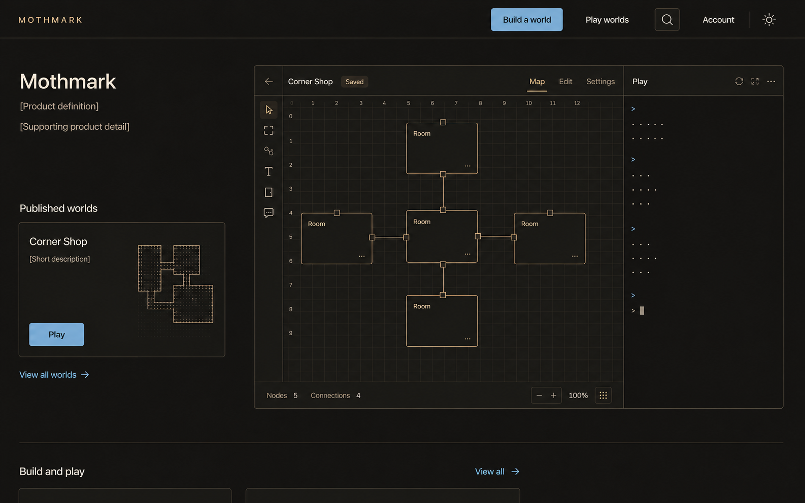

**Proposed layout and behavior:**

- Remove the narrow centered introduction card and use the normal page canvas.
- Keep every primary destination at the top: build or edit worlds, play or browse worlds, search,
  and the appropriate account action. The precise labels may change, but these paths must not be
  deferred to sections farther down the page.
- Follow the top actions with a short, factual product introduction. Do not turn it into a large
  slogan-led hero.
- Show real published worlds immediately after the introduction. This content should demonstrate
  what Mothmark is through playable work, in the same way Scratch's homepage exposes community
  projects instead of only describing its editor.
- Let the whole page scroll. Farther-down sections may explain building and playing through real
  product views, concrete capabilities, or maintained examples.
- Keep the page content-led and avoid generic landing-page devices: feature-card trios, statistics,
  testimonials, gradients, decorative badges, repeated eyebrow labels, and ornamental prose.

**Mothmark visual treatment:** Retain the quiet archive-workbench language: restrained typography,
semantic colors, subtle rules and surfaces, world cards, and real editor/player imagery. Do not copy
Scratch's colors, illustration style, rounded geometry, or youth-oriented presentation.

**Content fields still needed:** Keep copy as explicit stubs until the product wording is supplied.
The homepage needs values for:

- the one-sentence product definition;
- one supporting product-detail sentence;
- the build/edit path description;
- three or four concrete editor capabilities;
- the anonymous-account explanation;
- the registered-account explanation;
- the play/browse path description; and
- the published-world explanation.

**Reference:** [Scratch](https://scratch.mit.edu/) — specifically its immediate Create, Explore,
search, and account paths followed by real community projects.

### World library (`/worlds`)

**Direction:** Treat the private library as a restrained working scrapbook. It should feel like the
author is selecting a world from a collected folio, without using literal craft decoration.

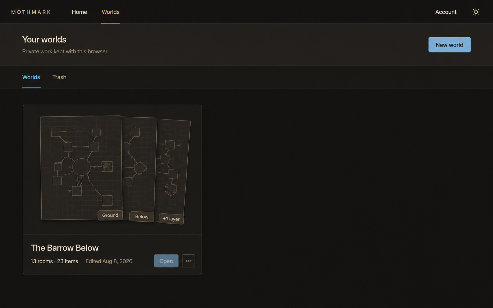

**Proposed layout and behavior:**

- Use the available page width for a responsive grid of substantial, content-led world cards rather
  than keeping the collection inside the current `820px` column.
- Keep the page title, `New world`, and Worlds/Trash controls in a pinned page header. Scroll the
  world collection independently beneath it.
- Represent each world as a small folio of its authored map layers instead of reducing the world to
  one arbitrary map thumbnail.
- Show up to three overlapping map fragments in the folio preview. Put the layer containing the
  starting room in front by default and use a factual `+N layers` count for the remainder.
- On hover or keyboard focus, spread the visible sheets slightly and reveal their layer names. Do
  not autoplay or cycle the preview. Provide an equivalent static selected state and respect reduced
  motion preferences.
- Keep the title and factual metadata consistently aligned outside the map cluster: last edited,
  room and item counts, and last opened. Reveal the world actions without shifting this information.
- Use short, restrained transitions to make selection feel tactile. Avoid fake tape, handwritten
  fonts, stickers, stains, heavy shadows, large random rotations, and other literal scrapbook props.

**Open detail:** A future author-selected cover layer could override the starting layer, but the
starting layer is the stable default. The exact amount of sheet overlap and movement remains a visual
design detail rather than a content requirement.

**References:** [Are.na Explore](https://www.are.na/explore) for its restrained archive character,
[Cosmos Explore](https://www.cosmos.so/explore) for clustered multi-image collection previews, and
[Playdate Catalog](https://play.date/games/catalog/) for confident but content-serving catalog
motion. None is a direct visual template for Mothmark.

### Account (`/account`)

**Implementation status (2026-08-11):** Implemented with the full-width account ledger, editable
public-profile fields, and public profiles at `/users/[username]`.

**Direction:** Present the account as an archival ownership record rather than a narrow settings
card. The page should clearly answer which account holds the author's worlds, how that account is
protected, and what operations are available.

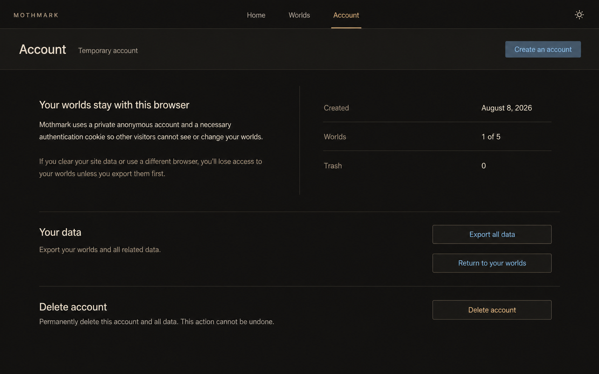

**Proposed layout and behavior:**

- Replace the centered `560px` card with a broad account page organized into clearly separated
  record sections.
- Keep a pinned page header containing `Account`, the current account state, and the primary
  state-dependent action. For a temporary account, that action is `Create an account`; registered
  accounts should expose their corresponding primary account action in the same position.
- Lead with a factual ownership and storage section. For temporary accounts, explain that worlds
  stay with the current browser, what can make them inaccessible, and how registration changes that
  condition.
- Present Created, Worlds, Trash, and similar values as compact record fields rather than prominent
  dashboard statistics.
- Group export and privacy controls in a distinct data section. Keep `Return to your worlds` as
  navigation rather than giving it the same weight as account operations.
- Put account deletion in a restrained, clearly separated danger section after ordinary account and
  data actions.
- Allow the page to scroll when registered-account content requires it, while keeping the identity
  and primary-action header available.

**Content treatment:** Preserve the current factual tone. Avoid promotional registration copy,
generic security reassurance, ornamental status badges, and equal card treatment for every action.
The visual model is a quiet account ledger: this account holds these worlds, under these conditions,
with these available operations.

### Privacy (`/privacy`)

**Direction:** Remove this page instead of redesigning it. Its current content repeats implementation
and account-retention details without serving a necessary product task, so preserving it would create
a more polished filler page rather than a more useful experience.

**Proposed removal:**

- Remove the `/privacy` page.
- Remove `Privacy and cookies` from the Account page's actions.
- Keep any operationally necessary account, storage, recovery, export, and deletion explanations at
  the point where the user makes the corresponding decision.
- Do not replace the page with generic legal or privacy copy.
- If Mothmark later introduces materially different practices such as editor recording, add the
  appropriate Terms of Service or policy surface at that time, based on the actual behavior being
  introduced.

### Starter-world JSON (`/starter`)

**Direction:** Remove this product-facing route rather than redesigning it. Asking authors to copy
and manually complete generated JSON contradicts the browser-based world-authoring experience.

**Proposed removal:**

- Remove the `/starter` page.
- Do not replace it with another standalone starter-document page.
- Keep blank-world and maintained starter-world choices in the `New world` flow.
- Keep any author-facing import or export of a complete world document with explicit world data
  controls.
- If a raw schema example remains useful to developers, maintain it in technical documentation or a
  development-only surface rather than the production application.

### Published-world catalog (`/play`)

**Direction:** Make this the primary public playing surface. It must be visually strong and make
entering a world immediate, while remaining recognizably Mothmark rather than becoming a generic
game-store grid.

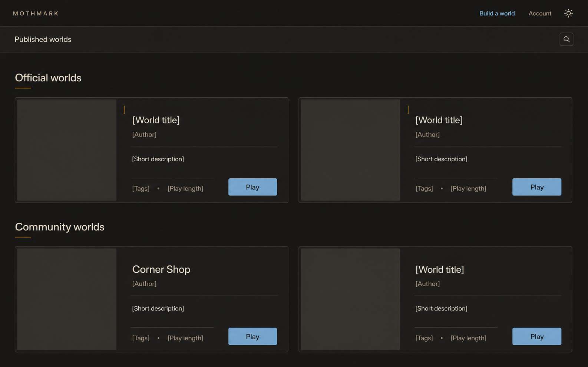

**Catalog structure:**

- Divide the catalog into `Official worlds` and `Community worlds`.
- `Official worlds` contains published worlds that an administrator has explicitly promoted to
  official status. Treat this as a factual editorial designation, not an algorithmic recommendation
  or quality score.
- Show official worlds first with slightly greater visual presence, but do not turn the section into
  a large promotional hero or carousel.
- Show the broader community catalog beneath it. Both sections use real published-world content and
  provide an immediate `Play` action.
- Home may show a small selection from these published worlds; `/play` remains the complete public
  discovery surface.

**Header and search:**

- Replace the current bulky combined header with smaller, distinct pieces: a compact global site
  bar, a concise catalog title row, and the catalog content below it.
- Remove the persistent full-width search field. Use one small magnifying-glass button with an
  accessible `Search published worlds` name.
- Activating search opens a focused dropdown anchored to the button. It should search across both
  official and community worlds, keep the catalog visible for context, and close predictably with
  Escape or outside interaction.
- Keep the compact navigation and search control available while the catalog scrolls without
  allowing the header to dominate the viewport.

**World-card requirements:**

- Use a responsive grid that takes advantage of the available canvas.
- Give each published world a deliberate presentation based on maintained or author-supplied data,
  never generated filler. Required catalog fields are title, author, short description, cover or
  presentation treatment, descriptive tags, approximate play length when known, published or
  updated date, and `Play`.
- Do not expose private editor map-layer previews in the public catalog; they may reveal world
  structure before play.
- Use a small, rare identity cue for official status. Avoid oversized badges, promotional ribbons,
  gradients, recommendation scores, and competing card actions.

**Visual character:** Treat the worlds like distinctive works in an archive rather than interchangeable
dashboard records. The catalog should feel polished enough to be the main entry to play, while its
typography, restrained surfaces, semantic colors, and motion remain within Mothmark's archive-workbench
language.

### Account entry (`/sign-in`, `/register`, `/forgot-password`, `/reset-password`, `/verify-email`)

**Direction:** Keep these short forms compact, but remove the generic centered-card composition and
the full application navigation. This is an intentional narrow-form exception rather than a page
that should stretch its controls across the viewport.

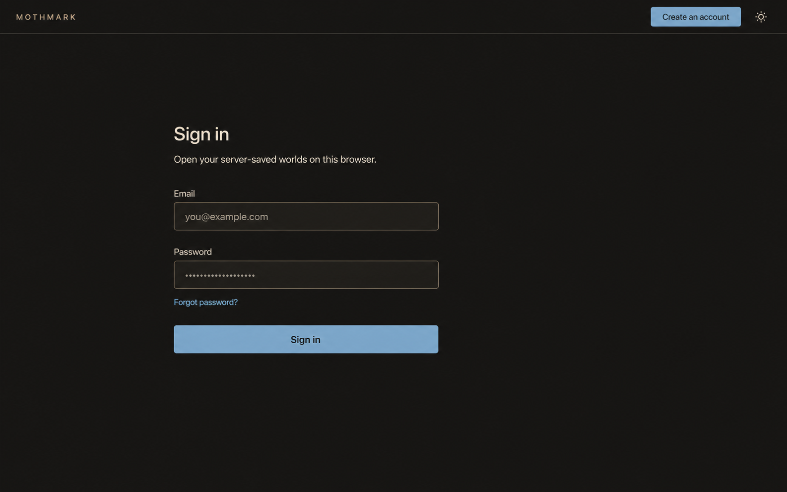

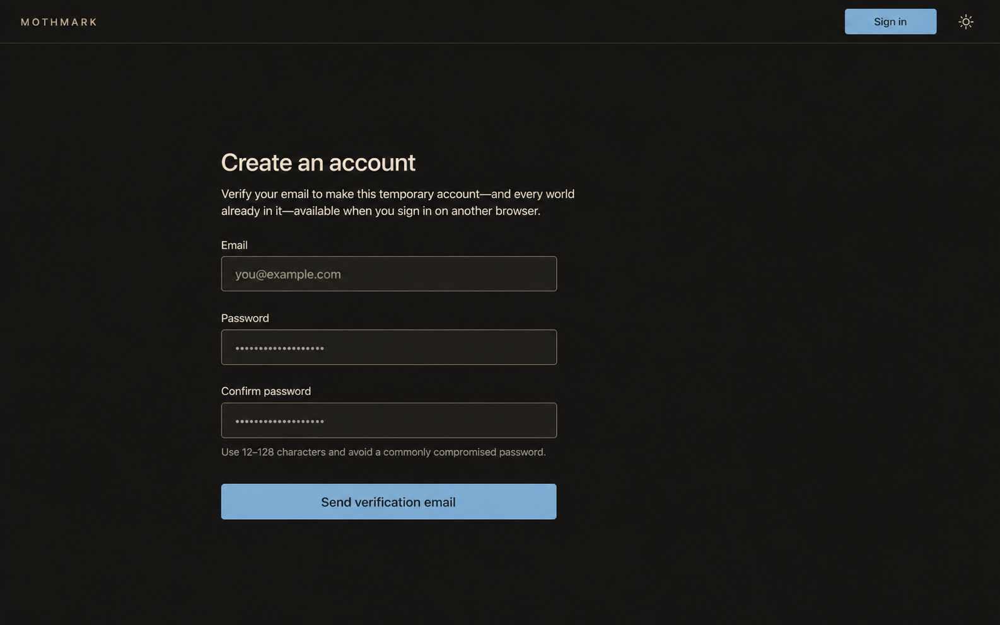

**Proposed shared shell:**

- Use a dedicated compact account bar, approximately the same 48px height as the application shell.
- Keep the small `MOTHMARK` home link at the left and the theme control at the right.
- Put the most relevant alternate account path in the right side of the bar. On Sign in, make
  `Create an account` a clearly visible compact action control rather than a quiet text link. It
  should be prominent without becoming a second large page hero.
- Do not show the normal Home/Worlds/Account navigation on account-entry routes.
- Place the compact form directly on the page canvas, slightly left of center on a deliberate page
  grid. Do not wrap it in a card or add a decorative second column.
- Use the route title, one factual supporting sentence when necessary, the required fields, the
  primary submit action, and only the directly relevant recovery or alternate-account link.
- Remove the repeated `Mothmark account` eyebrow and redundant `Return to Mothmark` link; the brand
  link in the compact bar supplies that return path.

**Route-specific behavior:** Registration should offer Sign in in the alternate-action position;
recovery and reset pages should offer the shortest useful return to Sign in; verification should
prioritize its result and next action. Keep all variants free of illustrations, feature lists,
testimonials, promotional reassurance, and ornamental filler.

**Forgot password:** Reuse the Sign-in layout and visual treatment directly; it does not need a
separate mockup. Put a prominent compact `Sign in` action in the account bar, omit `Create an
account` from the recovery form, and keep the form limited to email and `Send recovery email`. The
page still needs concise user-facing wording that explains the non-disclosing recovery response;
retain the current security explanation as a copy stub until that wording is supplied.

**Reset password:** Reuse the same account-entry shell without a separate mockup, but render its
states as distinct tasks:

- With a valid reset link, show `Choose a new password`, the session-revocation explanation, new and
  confirmation password fields, password guidance, and `Reset password`.
- With a missing, invalid, or expired link, do not render disabled password fields or a disabled
  submit button. Show the reason and make `Request a new recovery email` the primary action.
- After a successful reset, show a short confirmation and make `Sign in` the next action.
- In every state, use the compact account bar, omit `Create an account`, and avoid mixing recovery,
  registration, and reset actions on the same surface.

**Verify email:** Reuse the account-entry shell without a separate mockup and keep each verification
state focused:

- While verification is in progress, show a quiet progress state with no competing action.
- After successful verification, show a concise confirmation and one correct next action. Use
  `Continue to your worlds` when the verification leaves the account signed in; otherwise use
  `Sign in`.
- For a missing, invalid, or expired link, show the reason and make `Request another verification
email` the primary recovery action. Provide a direct resend path rather than sending the user
  through the registration form merely to request another message.
- Remove the `Mothmark account` eyebrow, generic card, full navigation, and redundant `Return to
Mothmark` link.

**Current spacing defect:** In the incomplete-link state, `Request another verification email` and
`Return to Mothmark` are placed too close together, so the two standalone links read as one crowded
action cluster. Do not carry this spacing into the revised state. If two stacked links are ever
required, separate their interactive rows with the normal 12–16px spacing rhythm; in the proposed
layout the redundant return link is removed entirely.

### Administrator sign-in (`/admin/sign-in`)

**Direction:** Make administrator sign-in look like the approved ordinary Sign-in page rather than
giving it a separate card or a more theatrical security treatment. It does not need a dedicated
mockup.

- Reuse the same compact 48px account-entry bar, open canvas, form position, field geometry,
  typography, colors, and primary-button treatment.
- Keep the small `MOTHMARK` home link and theme control in the bar. Provide `Return to Mothmark` as
  the relevant alternate path without restoring the full site navigation.
- Use `Administrator sign-in` as the form heading and remove the repeated `Mothmark administration`
  eyebrow.
- Preserve the factual explanation that provisioned credentials and a second factor are required.
- Keep the password and second-factor steps in the same form position so the transition does not
  cause a large layout shift.
- Do not add a unique administrator color scheme, security illustration, danger treatment, badge,
  registration link, or recovery link.

### Administrator users (`/admin/users`)

**Direction:** Treat user oversight as a dense operational workspace rather than a constrained table
card.

- Keep the compact administrator navigation bar pinned.
- Add a slim pinned local header containing `Users`, its factual oversight description, the account
  count, and user search.
- Make search compact but directly available for this operational table. It should match account
  identity fields such as registered email and anonymous account identifier; do not treat it as a
  global site search.
- Let the table use nearly the full available width and height instead of remaining inside the
  current `1180px` page constraint.
- Scroll the table body beneath sticky column headings. Keep the user identity column visible when
  horizontal scrolling is unavoidable at narrow widths.
- Preserve readable dates, limits, world counts, and cleanup state while keeping rows compact enough
  for oversight.
- Use restrained semantic status cues and avoid turning ordinary values into pills or separate row
  cards.

The administration area adopts the new palette and compact-shell discipline, but remains
deliberately denser than public discovery and private world-library pages.

### Administrator user detail (`/admin/users/[id]`)

**Direction:** Reorganize the very long user record as a broad administrative workspace. Widening
the current stack of cards is insufficient because its repeated sections, especially Permissions,
make comparison and navigation difficult.

- Keep a pinned local identity header containing back navigation, account identity, status, and the
  internal account ID.
- Add a compact anchored section index for `Overview`, `Controls`, `Worlds`, `Sessions`, and
  `Permissions`. The whole page may scroll while the identity and section navigation remain
  available.
- Present account and security metadata as a broad administrative ledger rather than a separate card
  for every group of values.
- Keep active-world limit controls near the top. Separate suspension and its required administrative
  reason from ordinary limit changes so a destructive account action cannot be mistaken for routine
  editing.
- Present owned worlds as a compact linked table with revision and lifecycle state.
- Present sessions as a full-width table with sticky column headings and clearly scoped row actions.
- Replace the long sequence of repeated permission controls with a dense comparison table containing
  Permission, Effective result, Source, and Override columns.
- Provide compact permission search because the permission catalog is already long and is expected
  to grow.
- Use rules and section spacing instead of wrapping every area in another equal-weight card.

The user record should remain information-dense and operational. It does not use the private-world
scrapbook treatment or public catalog cards.

### Administrator worlds (`/admin/worlds`)

**Direction:** Use the same dense, full-workspace list pattern as administrator Users. This is
operational inspection and should not reuse private-library scrapbook cards or map previews.

- Keep the compact administrator navigation pinned.
- Add a slim pinned local header containing `Worlds`, its oversight description, the world count,
  search, and a compact lifecycle filter.
- Search across world title, editor slug, registered owner email, and anonymous owner identifier.
- Filter between active and trashed worlds without turning each state into a separate page.
- Let the table use nearly the full available width and height, with sticky column headings and a
  scrolling body.
- Keep World and Owner columns visible when horizontal scrolling is unavoidable at narrow widths.
- Preserve linked world and owner identities along with revision, document size, lifecycle, and
  updated time.
- Use restrained lifecycle cues rather than badge-heavy rows or colored card treatments.

The current column set is useful. The proposal changes the surrounding layout, search and filtering,
and scroll behavior rather than converting oversight data into a more visual catalog.

### Administrator world detail (`/admin/worlds/[id]`)

**Direction:** Make world inspection understandable before exposing the raw document. The current
JSON block dominates the page even though it is a poor first representation of an authored world.

- Keep a pinned local identity header with back navigation, world title, lifecycle state, owner,
  revision, and private slug.
- Add compact section navigation for `Overview`, `Controls`, `Map`, and `Document`.
- Present metadata as a broad ledger.
- Use a read-only version of the real layered map as the default inspection surface. Preserve layer
  switching and authored geometry without exposing editor mutation controls.
- Move raw JSON to `Document` and provide document search, copy, download, line wrapping, and syntax
  highlighting.
- Keep Export as an ordinary top-level action.
- Separate Archive, Transfer ownership, and Permanently delete according to risk instead of placing
  every operation behind one ambiguous reason field.
- Request an administrative reason beside the specific sensitive action or in its confirmation
  dialog.
- Replace the raw target-user UUID input with account search and selection. Show the target account's
  current world count and limit before transfer confirmation.

**Current content defect:** The administrative-reason placeholder says the reason is required for
“editing,” while the world document is labeled `Inspection only`. Remove or correct that claim when
the controls are reorganized.

### Administration-wide layout priority

Across all administrator pages, functionality outranks decorative presentation. Use the potential
new style only to provide a compact coherent shell, readable hierarchy, accessible controls, and
consistent semantic states. The primary goals are:

- fast search, filtering, and comparison;
- full use of the available workspace;
- pinned identity, table headings, and task controls where they preserve context;
- dense but readable tables and record fields;
- explicit action scope, reasons, confirmation, and consequences;
- clear separation of routine, sensitive, and destructive operations; and
- direct navigation between related users, worlds, publications, sessions, and audit events.

Do not spend administrative space on scrapbook metaphors, world-cover treatments, decorative
animation, large empty canvases, or ornamental cards. Small restrained transitions and the shared
semantic palette are sufficient.

### Administrator publications (`/admin/publications`)

**Direction:** Reuse the functional full-workspace administrator table pattern and make publication
curation and release state directly inspectable.

- Keep a compact pinned local header with the publication count, search, and filters.
- Search by publication title, public slug, owner identity, and selected release.
- Filter by visibility and Official/Community editorial status.
- Add an `Official` column. This is the primary oversight surface for the administrator promotion
  that determines the `Official worlds` section on `/play`.
- Make promotion and demotion explicit administrative actions with confirmation and a required audit
  reason.
- Preserve linked owner identity and the selected immutable release.
- Provide a direct public-player link separately from the administrator-detail link.
- Show Published and Last updated times when they differ.
- Use a full-width table with sticky headings and restrained status treatment rather than giving the
  list a publication-specific decorative design.

### Administrator publication detail (`/admin/publications/[id]`)

**Direction:** Make this the functional curation and immutable-release inspection record for one
published world.

- Keep a pinned identity header with back navigation, publication title, status, visibility,
  Official/Community state, public URL, and the most relevant curation action.
- Present publication metadata as a broad ledger with direct links to the owner, source private
  world, selected immutable release, and public player.
- Add explicit Promote to official and Return to community actions. Require confirmation and an
  administrative audit reason for both.
- Keep listing visibility and publication lifecycle actions separate from official editorial status;
  unlisting a world and demoting it are different operations.
- Provide an immutable-release inspection area with release number, publication time, document size,
  schema version, download, and a route to inspect the snapshot when needed.
- Show the actual author-supplied catalog fields used by `/play`: title, author, short description,
  cover or presentation treatment, tags, and play length when available.
- Flag missing required catalog fields rather than displaying or generating filler. The current
  summary `This is a world.` is insufficient and should remain a visible content-quality issue until
  the author supplies a deliberate summary.
- Include publication-specific audit history or direct links to the filtered Audit view for curation,
  visibility, release, and lifecycle changes.

### Administrator audit (`/admin/audit`)

**Direction:** Treat Audit history as a queryable operational log. The current raw UUID and action
text fields make filtering unnecessarily difficult, while inline detail JSON makes rows too wide.

- Keep a compact pinned header with the shown/total event count and active-filter summary.
- Use a pinned or collapsible filter row with account search for Actor, an action combobox or
  autocomplete, target type plus target search, and a real date-range control.
- Resolve selected actors and targets to readable identities while preserving their internal IDs.
- Persist filters in the URL so an investigation can be linked or revisited.
- Use a full-width table with sticky headings and a scrolling body. Keep Date, Actor, Action, Target,
  and Reason directly comparable.
- Replace always-visible detail JSON with an expandable row or side inspector. Format changed values
  as readable before/after fields while retaining access to the raw event payload.
- Link actors and targets to the corresponding administrator user, world, or publication records.
- Provide deterministic pagination or load-more behavior, and make the current result count distinct
  from the total matching count.
- Preserve timestamps with an explicit timezone and provide export only if it serves an actual
  operational or compliance workflow.

The audit page uses the same restrained administrator shell and table geometry; its usefulness comes
from reliable filtering, readable event details, and navigable relationships rather than a unique
visual treatment.

### Editor items (`/worlds/[editorSlug]`, Items view)

**Direction:** Items are their own collection of authored objects. Do not bring the map into this
view and do not use the right property inspector as the primary editing surface. The interaction is
a two-screen flow: select a tangible-looking object from the collection, then open a dedicated page
that gives that object the full editor workspace.

The earlier map split, map tray, and location-led ledger concepts were rejected. They made location
structure dominate a surface that should instead evoke items, little trinkets, and treasure. The
first object-gallery mockup was also rejected because it assumed item illustrations that do not
exist in the current schema or authored content. The subsequent text-led label grid was rejected as
well: removing the illustrations did not remove its dashboard grammar of counts, filters, repeated
bordered tiles, and per-tile metadata.

#### Item selector

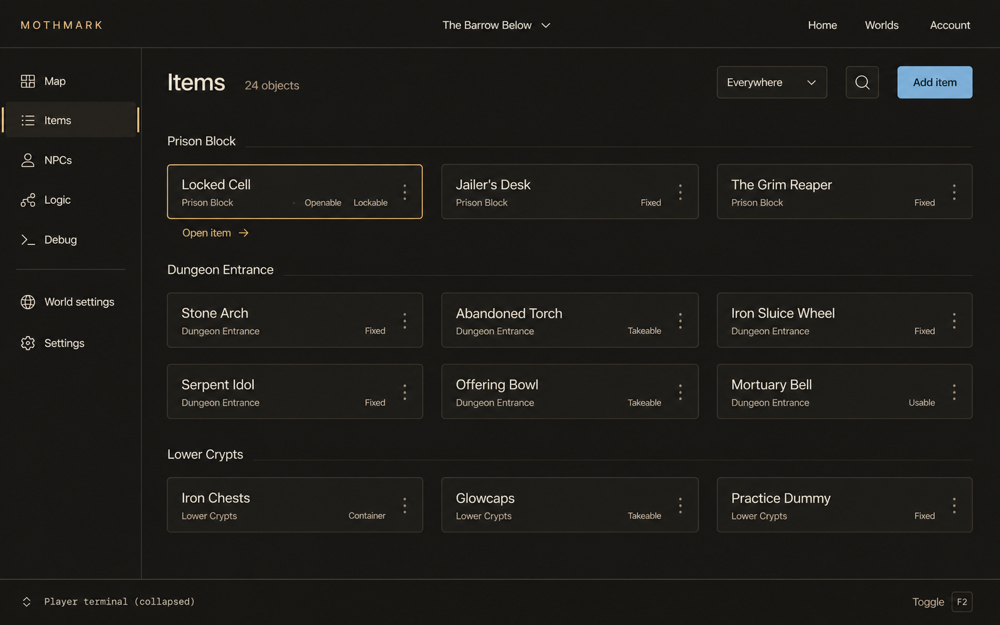

**Status:** Rejected visual composition. Retain only the no-image constraint and the two-screen
selector-to-detail flow.

- Use the full workspace as one continuous collection surface rather than a narrow card or
  administrative table.
- Make the authored item name its visual identity. Present names as restrained accession labels or
  nameplates with quiet location and behavior context; do not infer or generate an object's
  appearance from its name.
- Use only small abstract marks and labels derived from actual schema behaviors such as Fixed,
  Takeable, Container, Openable, Lockable, Surface, Door, and Usable. These communicate capability,
  not the object's physical appearance.
- Grouping by starting location is useful organization, but it must remain subordinate to the
  objects. Use simple headings or a compact location filter; do not display a map.
- Search stays behind a compact magnifying-glass control. Keep `Add item` prominent in the pinned
  local header.
- Selecting an object reveals a clear `Open item` action and can use a restrained brass outline or
  slight lift. Double-click and keyboard activation may open it directly if that remains accessible
  and discoverable.
- Keep the collection tactile without turning it into an RPG inventory: no slot grid, rarity colors,
  equipment conventions, statistics, loot framing, or ornamental fantasy chrome.
- Collapse the player terminal to a thin dock by default so the selector has room, while keeping it
  available for testing.

#### Full item page

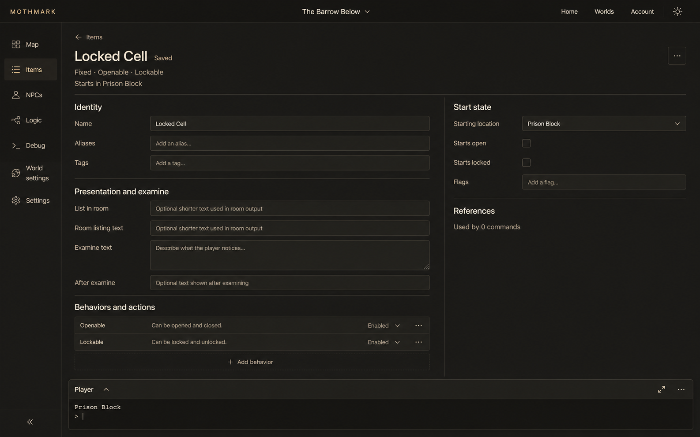

**Status:** Rejected visual composition. Its two-column grouping still reads as a settings dashboard.

- Open the selected item as a dedicated editor page with `Items` back navigation and the item name,
  save state, behavior summary, starting-location summary, and item-level actions in its local
  header. Do not reserve space for missing artwork.
- Remove the right inspector from this view. The item page uses the complete workspace for its form
  and may scroll as one page when the schema requires more fields.
- Organize ordinary fields into readable, continuous sections such as `Player-facing text`,
  `Behavior`, `Commands`, `Placement`, `Containment`, `Important tags`, and `Identity`. Do not make
  every field group a separate floating card.
- Prefer one continuous authoring document. Let identity, player-facing text, behavior, and starting
  state flow vertically instead of isolating compact fields in a second utility column.
- Keep the player terminal available at the bottom for immediate testing. Its command/output flow
  remains uninterrupted and it can be resized or collapsed independently of the item page.
- Use real schema fields and authored copy. Empty fields should contain direct instructional
  placeholders, never generated lore or ornamental descriptions.

#### Rejected composition experiments

These mockups tested different interaction character and were rejected. The shelf treatment still
felt like an organized catalog, while the open name field became decorative typography without
making the entries feel like objects. The single-document editor was cleaner than the two-column
version but did not solve the selector's missing visual identity.

**Word shelves:** Item names rest directly on quiet location shelves. Only the focused name exposes
metadata in one shared strip, avoiding repeated item containers.

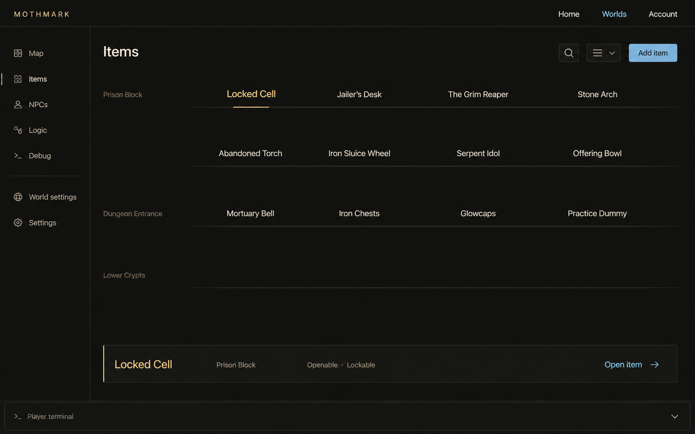

**Name field:** Item names occupy an open typographic field. The selection comes forward and exposes
its single contextual line. This is the least conventional and needs the most scrutiny for scanning,
ordering, keyboard navigation, and large collections.

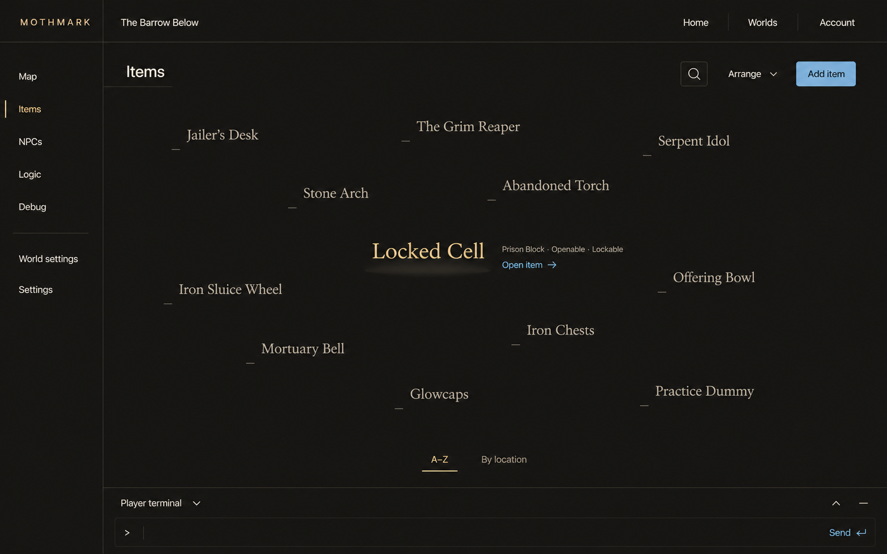

**Single item document:** The dedicated item editor becomes one vertically flowing authoring
document. Fields are editable lines and writing areas; behaviors are expandable rows; starting state
is expressed directly rather than placed in a secondary settings column.

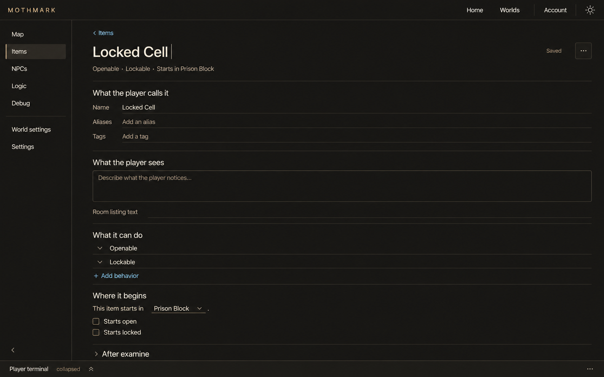

#### Current Mothmark identity experiments

These options introduce a stable abstract mark for each item. A Mothmark is generated from item
identity and schema behavior; it is not an illustration or an inference about physical appearance.
No option has been selected.

**Procedural tokens:** Show the whole collection as individual abstract seals on an open work
surface. Names remain visible, selection lifts one token, and a single shared strip exposes its
location, behaviors, and `Open item` action.

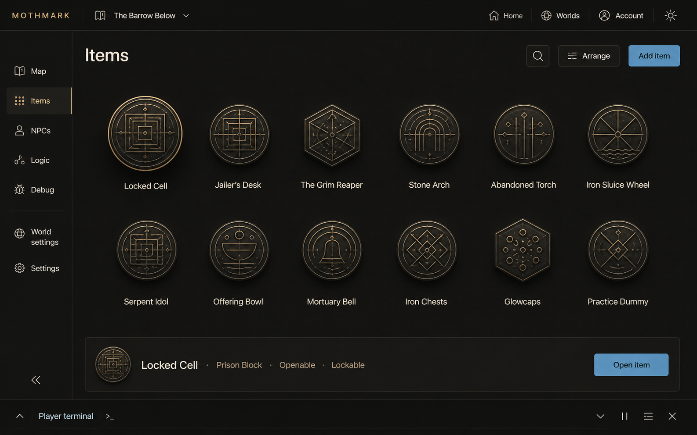

**Archive tag rack:** Attach each name and abstract mark to a restrained accession tag. Selection
pulls one tag forward. This supplies the strongest physical-trinket metaphor, but its vertical-label
legibility, density, motion, and literalness require scrutiny.

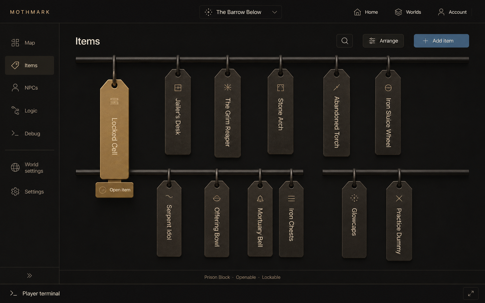

**Direction retained:** The tag rack is the preferred interaction metaphor, but its vertical names,
realistic metallic treatment, and per-item procedural marks are not. Names must read horizontally,
and item art should come from a small maintained category library rather than bespoke or generated
art.

**Object flip-file:** Focus on one object at a time, with adjacent names exposed as tabs and direct
search/browse controls for larger collections. This gives every object a strong moment of identity
but reduces at-a-glance comparison.

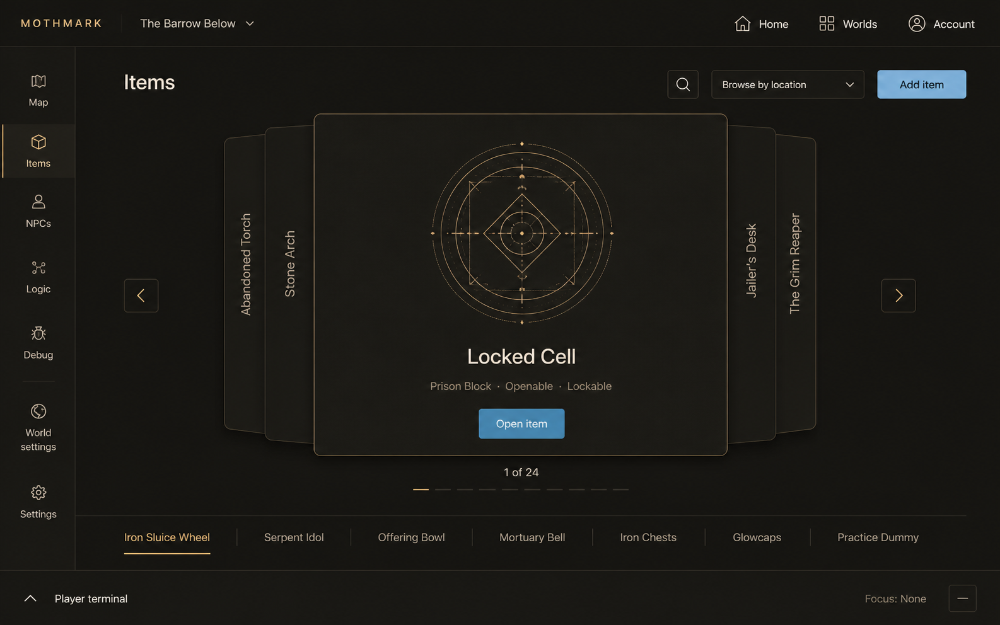

**Mothmark item document:** Carry the selected abstract mark into the dedicated, vertically flowing
item page as a stable identity handle. It does not replace or decorate the authored fields.

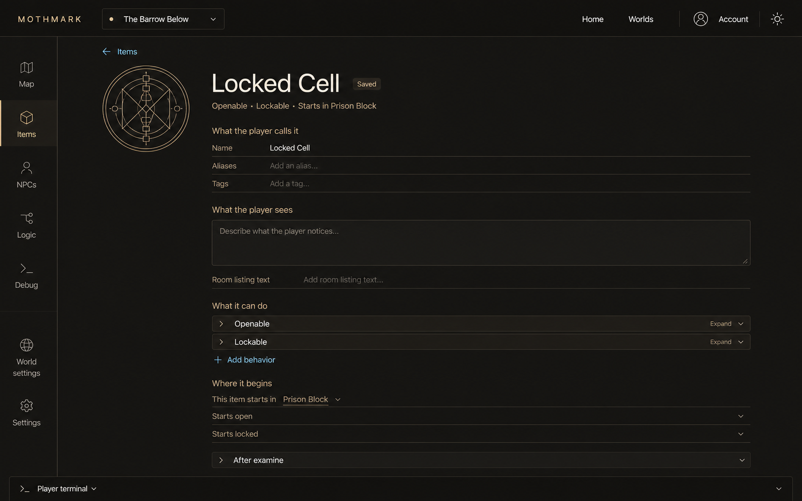

#### Current horizontal tag-rack refinements

Mothmark can maintain roughly 20 reusable, stylized SVG category marks. Recognized author tags map
an item to one of these marks; unmatched items use a neutral fallback. The marks are deliberately
simple enough to hand-author and render with inline SVG or canvas from TypeScript. They use flat
fills, a few bold paths, and consistent geometry—not realistic materials, texture, lighting, or
bespoke art for every item.

**Flat hanging labels:** Keep the SVG category mark and horizontal item name together on one broad,
flat tag.

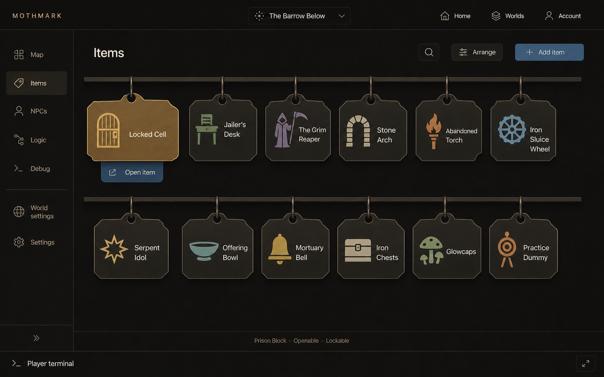

**Color-block charms:** Separate the category mark into a small flat charm joined to a horizontal
nameplate. This gives the reusable SVG system more visual presence while keeping the name easy to
scan.

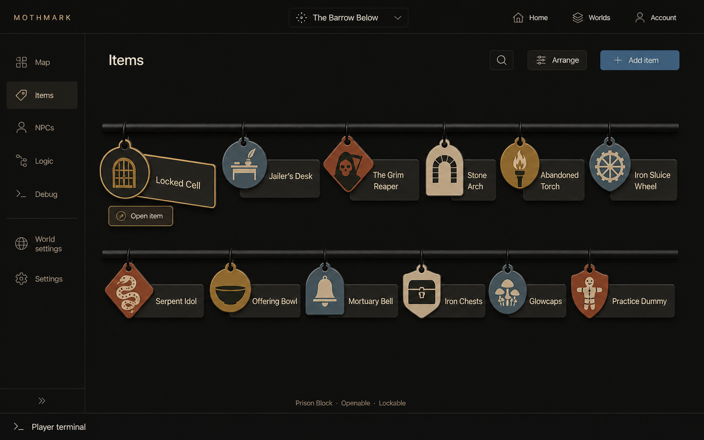

#### Agreed category SVG taxonomy

Maintain 20 reusable category marks, including the generic fallback. This decides what each mark
represents, not its final drawing style. The eventual drawings should remain flat, stylized,
deliberately non-metallic, and simple enough to maintain as hand-authored SVG or TypeScript-rendered
vector geometry.

| Category  | Representational subject                        | Recognized ordinary tags                                                                        |
| --------- | ----------------------------------------------- | ----------------------------------------------------------------------------------------------- |
| Generic   | A circle, square, and triangle grouped together | `generic`, `misc`, `miscellaneous`, `other`; also the fallback for every unmatched item         |
| Structure | A short stone pillar built from blocks          | `structure`, `architecture`, `wall`, `pillar`, `column`, `arch`, `bridge`, `platform`, `stairs` |
| Door      | A door                                          | `door`, `gate`, `hatch`, `portal`, `portcullis`, `barrier`, `entrance`, `exit`                  |
| Furniture | A chair                                         | `furniture`, `chair`, `table`, `desk`, `bed`, `bench`, `shelf`, `cabinet`, `counter`, `rack`    |
| Container | A chest                                         | `container`, `chest`, `box`, `crate`, `barrel`, `bag`, `pouch`, `locker`, `vessel`              |
| Mechanism | Gears                                           | `mechanism`, `machine`, `device`, `gear`, `lever`, `switch`, `wheel`, `trap`, `clockwork`       |
| Tool      | A crossed pick and hammer                       | `tool`, `implement`, `utensil`, `crafting`, `hammer`, `pick`, `shovel`, `rope`, `training`      |
| Key       | A key                                           | `key`, `lockpick`, `access`, `pass`, `permit`                                                   |
| Weapon    | Crossed swords                                  | `weapon`, `sword`, `dagger`, `axe`, `bow`, `spear`, `club`, `firearm`                           |
| Wearable  | A hat                                           | `wearable`, `clothing`, `garment`, `armor`, `helmet`, `boots`, `gloves`                         |
| Light     | A lantern                                       | `light`, `fire`, `torch`, `lantern`, `lamp`, `candle`, `brazier`                                |
| Document  | A book                                          | `document`, `book`, `note`, `letter`, `scroll`, `map`, `journal`, `record`                      |
| Food      | An apple                                        | `food`, `drink`, `edible`, `consumable`, `ingredient`, `fruit`, `meal`                          |
| Nature    | A leaf                                          | `nature`, `plant`, `flora`, `fungus`, `tree`, `herb`, `flower`, `rock`, `mineral`               |
| Remains   | A skull                                         | `remains`, `corpse`, `body`, `bone`, `bones`, `skull`, `skeleton`, `grave`                      |
| Art       | A statue                                        | `art`, `statue`, `sculpture`, `painting`, `portrait`, `mural`, `tapestry`, `carving`            |
| Relic     | A small reliquary or peaked shrine              | `relic`, `ritual`, `sacred`, `holy`, `shrine`, `altar`, `idol`, `ceremonial`                    |
| Treasure  | A gem                                           | `treasure`, `valuable`, `gem`, `coin`, `currency`, `gold`, `jewel`, `precious`                  |
| Music     | A musical note                                  | `music`, `musical`, `instrument`, `sound`, `bell`, `horn`, `chime`                              |
| Magic     | An open hand holding a hovering orb             | `magic`, `magical`, `arcane`, `enchanted`, `spell`, `sorcery`                                   |

**Matching contract:**

1. An explicit `icon:<category>` tag chooses that category.
2. Otherwise, normalize tags by trimming whitespace and ignoring case, then use the first recognized
   ordinary tag in the item's saved tag order.
3. Never inspect the item name, description, behavior, or other content to infer a category.
4. If nothing matches, use Generic.

The explicit override is authorial presentation metadata, not gameplay identity. Conflicting
ordinary tags resolve by saved order so the result is predictable and controllable without a hidden
priority system.

Do not add more initial categories for isolated edge cases. Potions resolve to Food or Magic;
vehicles to Mechanism; raw materials to Nature or Generic; jewelry to Wearable or Treasure; toys and
games to Generic. Living creatures do not belong in the item taxonomy; dead creatures may use
Remains. Revisit the category count only after real authored collections reveal a recurring gap.

The item name must remain accessible and visible when a mark is absent or fails to render. Category
marks are optional presentation and must never become command targeting data.

Shared requirements:

- Preserve the existing editor activity rail and compact application shell.
- Use the Mothmark semantic palette and quiet archive-workbench treatment.
- Do not require item images, thumbnails, or object-specific icons; none exist in the item schema.
  Do not generate or infer them from names. A maintained set of reusable tag-selected SVG categories
  may provide visual identity without creating bespoke artwork for every item.
- The selector must handle items with no starting location, items inside other items, many items with
  similar names or icons, large collections, keyboard navigation, and a no-illustration fallback.
- The full item page must derive its controls from the current item schema and remain usable at the
  minimum workspace width.

### Editor Map (`/worlds/[editorSlug]`, Map view)

**Direction:** Preserve this as the reference full-workspace editor rather than redesigning it as a
page with a header and card.

- Keep the authored map filling the available workspace with its own scoped controls.
- Keep the editor activity rail, contextual property inspector, and independently resizable player
  terminal.
- Keep authored layer geometry and the deliberate light and dark map palettes intact when the wider
  application shell is restyled.
- Do not add an introductory card, page-level marketing copy, or a second map navigation surface.

This view already avoids the constrained-card problem. Future work is a visual-language alignment,
not a structural page-layout replacement.

### Editor Story / NPCs (`/worlds/[editorSlug]`, NPCs rail item)

**Direction:** Remove this destination from the activity rail until it represents a real authoring
model. Do not turn the current placeholder into a polished empty page.

- The rail calls the destination `NPCs`, while the workspace calls it `Story` and describes a
  connection between text and entities. These are different product concepts and should not share
  one ambiguous placeholder.
- The current world schema has no NPC, character, or story collection. There is therefore no real
  object to list, select, edit, validate, or play.
- When a runtime-backed character or story model is deliberately restored, define its author task
  first and add the corresponding workspace then.
- A future entity collection should use a full-workspace selector followed by a dedicated entity
  editor, not a dashboard of summary cards. Its controls must come from the real schema and player
  behavior.

Until then, hiding the unfinished destination communicates the product more honestly than filler
copy promising a future editor.

### Editor Issues (`/worlds/[editorSlug]`, Issues view)

**Direction:** Replace the placeholder card with a full-workspace validation queue. This is a real
authoring task and should make broken world logic findable and repairable.

- Use a compact pinned local header with `Issues`, the current error and warning counts, and a
  refresh or validation-status control only if validation is not already live.
- Let the results fill the remaining width and height. Group by severity first and entity second,
  with compact filters for severity and entity type.
- Each issue needs a plain-language problem, the affected entity and field, and a direct action that
  opens the correct editor with that field focused.
- Use one scrolling results region with sticky group or column headings. Avoid a narrow centered
  card, equal-sized issue tiles, or an ornamental health score.
- The empty state should simply state that no current issues were found and when validation ran.
- Keep the player terminal available because command output can help reproduce a problem; the right
  inspector should show context only after an issue or affected entity is selected.

### Editor World settings (`/worlds/[editorSlug]`, World settings view)

**Direction:** Turn this into a broad, vertically scrolling world document with a compact pinned
local header. The current reset-and-publishing card is both too narrow and too incomplete to serve
as world settings.

- Put the world title and save state in the pinned local header. Keep ordinary page actions at the
  top; the settings document beneath it may scroll.
- Use continuous sections separated by rules, not a grid of dashboard cards.
- `Identity` contains the real metadata fields: title, author, description, and version.
- `Starting experience` contains the start room, death message, and initial flag and counter values.
- Keep map layers in the Map workspace, where they have spatial context, rather than duplicating a
  layer manager in settings.
- `Publication` contains the actual publishing state, catalog-field readiness, selected release,
  and publish/update/unpublish actions. If the current account is ineligible, show the precise
  requirement and next action instead of silently omitting the section.
- `World data` contains deliberate import and export operations when supported.
- Put reset and other destructive actions in a final danger section with explicit consequences and
  confirmation. Reset may still use the maintained bundled starter world even though the separate
  `/starter` route is removed.
- The document should use the full center workspace and should not depend on the right inspector.
  Keep the player terminal independently collapsible for quick verification of starting-state
  changes.

### Editor Settings (`/worlds/[editorSlug]`, Settings view)

**Direction:** Remove the activity-rail destination until Mothmark has several meaningful editor
preferences. The current page is filler and has no controls.

- Keep theme selection in the global application shell where it already applies across the site.
- Persist workspace sizes and other reversible view state directly when those controls are used;
  do not create a settings page merely to restate them.
- If future preferences form a coherent task, use a compact settings popover for a few global
  choices or a full-width settings document for a substantial set. Do not restore a single centered
  placeholder card.

### Editor Logic overview (`/worlds/[editorSlug]`, Logic view)

**Direction:** Remove the centered four-card launcher. Enter Logic directly in the last-used real
subsection, with Events as the initial default, and switch subsections from a compact pinned logic
toolbar.

- The subsection switcher contains Events and Commands now. Add Conditions and Effects only when
  their dedicated editors work; do not link to dead placeholder pages.
- Keep the switcher, current subsection identity, search, and creation action outside the scrolling
  collection or tree.
- Preserve subsection-specific layout instead of forcing Events and Commands into one generic card
  system.
- Do not add overview statistics, recent-activity cards, or explanatory tiles simply to occupy the
  workspace.

This removes an unnecessary navigation step and makes `Logic` lead to authoring rather than a small
dashboard.

### Editor Conditions and Effects (`/worlds/[editorSlug]`, Logic subsections)

**Direction:** Hide these entries while they are placeholders. When implemented, each becomes a
schema-driven, full-workspace library and editor for the reusable objects already present in the
world schema.

- Conditions and effects must derive their supported types, operations, fields, labels, and defaults
  from their schemas rather than a parallel visual catalog.
- Put library selection, search, and creation in the main workspace. Open an editor directly from
  its workspace control rather than requiring a detour through the right inspector.
- Show where a reusable condition or effect is referenced so authors can understand the impact of
  edits before changing or deleting it.
- Use the existing typed command-variable binding path for ordinary schema fields.
- Keep the editor full-height with deliberate internal scrolling and a pinned local toolbar; do not
  return to a centered card or four-tile logic home.

### Editor Events and Commands (`/worlds/[editorSlug]`, Logic subsections)

**Direction:** Preserve their existing full-height workspace structures. They are useful reference
compositions for the rest of the editor.

- Events keeps its rail-and-tree layout and sticky branch toolbar.
- Commands keeps command selection in the command library, with search and `New command` above the
  independently scrolling list.
- Command behavior and pattern controls remain pinned above the pattern workspace. Do not add a
  second command scroller inside the editor.
- Both surfaces may receive the shared visual-style cleanup, but they do not need a page-header-plus-
  card redesign.

### Hosted player (`/play/[world]`)

**Direction:** Preserve the full-height terminal as the page's primary surface. It is the destination
reached from the public catalog and should feel like entering the web application, not opening a
promotional detail page.

- Keep a compact fixed-height header outside the terminal scroll, with world identity, the shortest
  useful return to discovery, and only real player actions.
- Keep terminal output as one uninterrupted monospace flow and keep the command prompt available as
  output grows.
- Let terminal output own scrolling. Do not wrap the player in a centered card, add a right sidebar,
  or precede play with an invented synopsis or feature panel.
- Use author-supplied world metadata where identity is needed and never reveal private editor map
  layers as decoration.

### Routes without an independent product surface

These routes do not need separate page proposals:

- `/admin` redirects to `/admin/users`.
- `/editor` and `/editor/[worldId]` are legacy aliases for the canonical private editor route and
  should remain redirects rather than parallel visual systems.
- Routes under `/test/*` are development harnesses, not production navigation destinations. Their
  constrained matrices and cards are allowed to serve component testing and are excluded from the
  application-page design contract.

With those exclusions, every production route and every activity-rail or Logic workspace reachable
from the current editor now has a recorded redesign, removal, deferral, or preserve-as-is decision.
